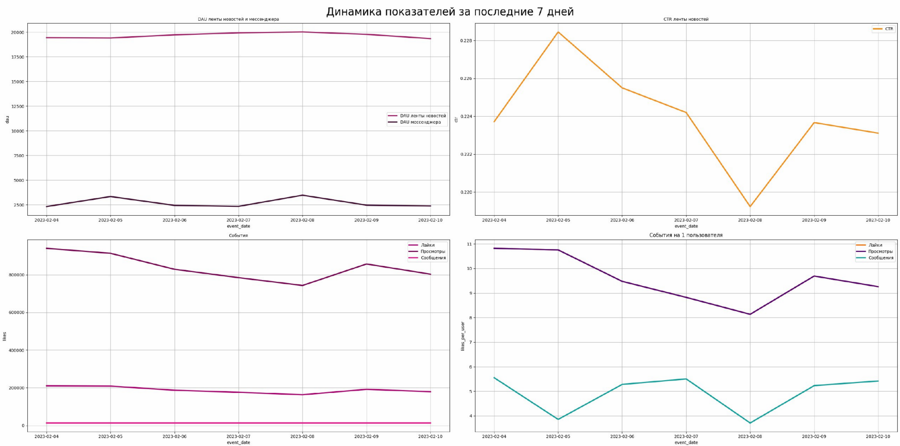

**Task**

Create telegram bot. Write a script to build a report.
The report should be in two parts:

*text with information about the value of key metrics for the previous day*

*graph with metric values for the previous 7 days*

Display the following key metrics in the report:

*DAU*

*Views* 

*Likes*

*CTR*

Automate report with Airflow.

Result:

Добрый день, значения ключевых метрик ленты новостей и мессенджера за последние 7 дней:
        по состоянию на дату: 10-02-2023 

1. DAU ленты новостей: 19 343 

2. DAU мессенджера: 2 380

3. Лайки: 179 118 

4. Просмотры: 802 837 

5. CTR ленты новостей: 0.2 

6. Отправлено сообщений: 12 900

